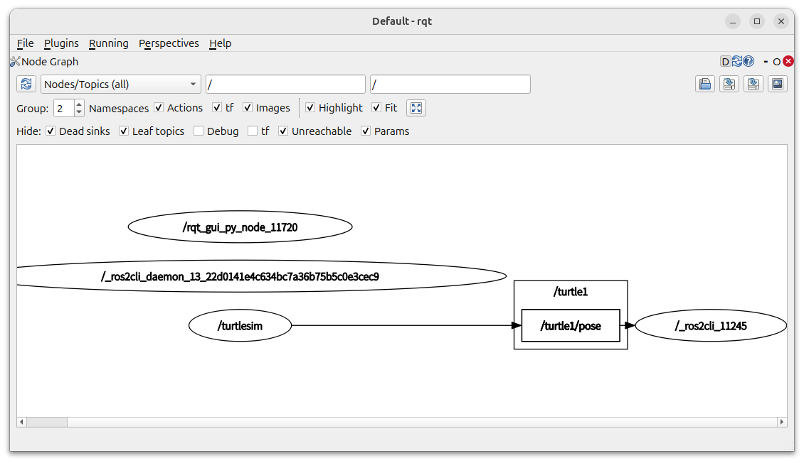
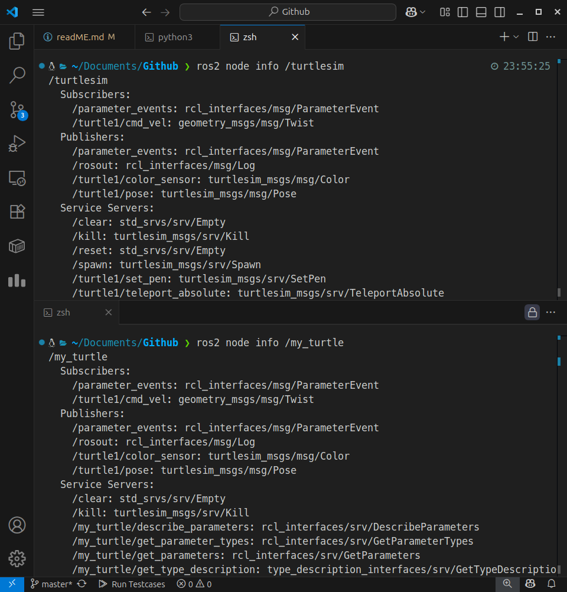
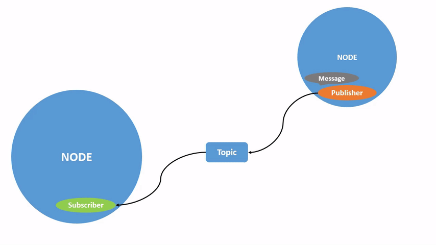
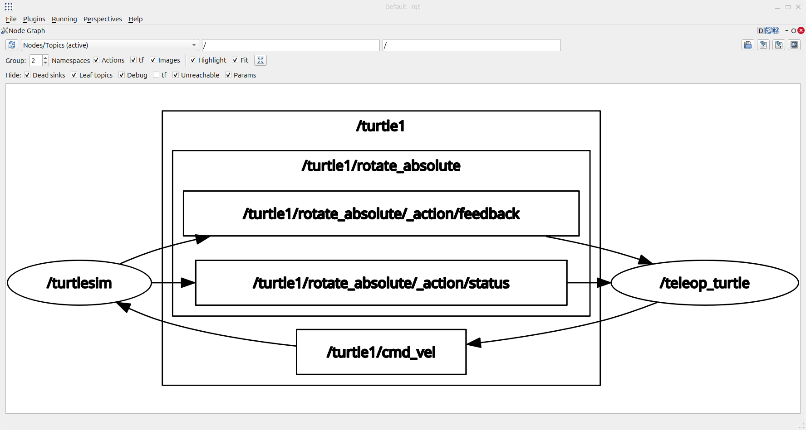

# ROS2 공식문서 스터디 및 정리 레파지토리
위 레파지토리는 ROS2공식 문서를 공부한 뒤 정리하는 공간입니다.

## 진도

25.07.18 <br />
https://docs.ros.org/en/rolling/Tutorials/Beginner-CLI-Tools/Introducing-Turtlesim/Introducing-Turtlesim.html<br />
25.07.21 <br />
https://docs.ros.org/en/rolling/Tutorials/Beginner-CLI-Tools/Understanding-ROS2-Topics/Understanding-ROS2-Topics.html#ros2-topic-echo<br />


## 목차
- [1. VSCODE 설정](#vscode-terminal에서-ros-실행시-발생하는-오류)
- [2. 파이썬 가상환경](#파이썬-가상환경-만들기)rrrfds
- [3. 도메인](#도메인)
- [4. service](#service)
- [5. topic](#topic22)
- [5. Using Turtlesim And rqt](#using-turtlesim_teleop_key-we-can-move-turtle)
- [6. Node](#node)
- [7. Understanding Topic](#topic)

<br />
<br />
<br />

## VSCODE terminal에서 ros 실행시 발생하는 오류
### vscode terminal에서 ros실행 시 오류가 발생한다.
아래코드는 공식문서에서 제시한 예시코드이다.
```bash
ros2 run turtlesim turtlesim_node
```

### 위 문제를 해결하기 위해서는 settings.json을 수정해주어야 한다.
아래 코드를 추가하자
```json
{
    ...
    "terminal.integrated.env.linux": {
        "GTK_PATH": ""
    },
    ...
}
```

<br />
<br />
<br />

## 파이썬 가상환경 만들기
[1. 가상환경을 만들기 위한 venv 설치](#1-가상환경을-만들기-위한-venv-설치)<br />
[2. 가상환경 생성](#2-가상환경-생성)<br />
[3. 해당 환경에서 파이프 업그레이트](#3-해당-환경에서-파이프-업그레이드)<br />
[4. jupyter설치](#4-jupyter-설치)<br />


### 1. 가상환경을 만들기 위한 venv 설치
```bash
$ sudo apt install python3.12-venv
```
### 2. 가상환경 생성

```bash
$ python3 -m venv ~/venv
$ source ~/venv/bin/activate
```

### 3. 해당 환경에서 파이프 업그레이드

```bash
$ pip install --upgrade pip
```

### 4. jupyter 설치

```bash
$ pip install jupyter
```

## 도메인
### 같은 공유기 내에서 묶는 도구로서 도메인을 사용한다.
> 즉 도메인이 같은 디바이스끼리 연결됨

```bash
alias sz="source ~/.zshrc; echo \"bashrc is reloaded\""
alias ros_domain="export ROS_DOMAIN_ID=13; echo \"ROS_DOMAIN_ID=13\""
alias rolling="source /opt/ros/rolling/setup.zsh; ros_domain; echo \"ROS2 rolling is activated!\""
```

> ROS_DOMAIN_ID를 13번으로 함

<br />
<br />
<br />

## service
[1. 서비스 조회하기](#서비스-리스트를-확인하면-호출할-수-있는-서비스를-조회할-수-있다)<br />
[2. 서비스 타입 조회하기](#서비스-리스트를-확인하면-호출할-수-있는-서비스를-조회할-수-있다)<br />
[3. 요청타입과 응답타입 조회하기](#해당-타입의-요청-타입과-응답타입을-조회할-수-있다)<br />
[4. 서비스 호출하기](#해당-요청타입을-참고하여-서비스를-호출할-수-있다)<br />
[5. 리셋 서비스 호출하기](#리셋하는-서비스를-호출할-수-있다)<br />
[6. 추가 거북이를 스폰하기](#거북이-스폰하는-서비스-호출하기)<br />


### 서비스 리스트를 확인하면 호출할 수 있는 서비스를 조회할 수 있다.
```bash
╰─ ros2 service list      
/clear
/kill
/reset
/spawn
/turtle1/set_pen
/turtle1/teleport_absolute
/turtle1/teleport_relative
/turtlesim/describe_parameters
/turtlesim/get_parameter_types
/turtlesim/get_parameters
/turtlesim/get_type_description
/turtlesim/list_parameters
/turtlesim/set_parameters
/turtlesim/set_parameters_atomically

```

### 서비스의 타입을 조회할 수 있다.
```bash
╰─ ros2 service type /turtle1/teleport_absolute
turtlesim_msgs/srv/TeleportAbsolute
```

### 해당 타입의 요청 타입과 응답타입을 조회할 수 있다.
```bash
╰─ ros2 interface show turtlesim_msgs/srv/TeleportAbsolute
float32 x
float32 y
float32 theta
```

### 해당 요청타입을 참고하여 서비스를 호출할 수 있다.
```bash
╰─ ros2 service call /turtle1/teleport_absolute turtlesim_msgs/srv/TeleportAbsolute "{x: 2, y: 2, theta: 1.57}"
waiting for service to become available...
requester: making request: turtlesim_msgs.srv.TeleportAbsolute_Request(x=2.0, y=2.0, theta=1.57)

response:
turtlesim_msgs.srv.TeleportAbsolute_Response()

```


> 현재 위치가 바뀐것을 확인 할 수 있다.
> theta값은 거북이가 바라보는 방향을 의미한다.

### 리셋하는 서비스를 호출할 수 있다.
```bash
╰─ ros2 service call /reset std_srvs/srv/Empty 
waiting for service to become available...
requester: making request: std_srvs.srv.Empty_Request()

response:
std_srvs.srv.Empty_Response()
```


> 리셋 시 초기위치로 바뀐것을 확인할 수 있다.

### 거북이 스폰하는 서비스 호출하기
```bash
╭─  │  ~ ··························································································· ✔ │ at 17:23:46  
╰─ ros2 service type /spawn
turtlesim_msgs/srv/Spawn
╭─  │  ~ ··························································································· ✔ │ at 17:25:49  
╰─ ros2 interface show turtlesim_msgs/srv/Spawn
float32 x
float32 y
float32 theta
string name # Optional.  A unique name will be created and returned if this is empty
---
string name
╭─  │  ~ ··························································································· ✔ │ at 17:26:04  
╰─ ros2 service call /spawn turtlesim_msgs/srv/Spawn "{x: 1, y: 1, theta: 0, name: ''}"
waiting for service to become available...
requester: making request: turtlesim_msgs.srv.Spawn_Request(x=1.0, y=1.0, theta=0.0, name='')

response:
turtlesim_msgs.srv.Spawn_Response(name='turtle2')
```

<br />
<br />
<br />

## topic22
### topic를 조회할 수 있으며 `-v`옵션을 통해 발행 타입과 구독타입을 알 수 있다.
> Published topics는 터틀이 발행하는 토픽들이며 Subscribed topics는 터틀이 구독하는 토픽이다.

```bash
╰─ ros2 topic list -v
Published topics:
 * /parameter_events [rcl_interfaces/msg/ParameterEvent] 2 publishers
 * /rosout [rcl_interfaces/msg/Log] 2 publishers
 * /turtle1/color_sensor [turtlesim_msgs/msg/Color] 1 publisher
 * /turtle1/pose [turtlesim_msgs/msg/Pose] 1 publisher
 * /turtle2/color_sensor [turtlesim_msgs/msg/Color] 1 publisher
 * /turtle2/pose [turtlesim_msgs/msg/Pose] 1 publisher

Subscribed topics:
 * /parameter_events [rcl_interfaces/msg/ParameterEvent] 1 subscriber
 * /turtle1/cmd_vel [geometry_msgs/msg/Twist] 1 subscriber
 * /turtle2/cmd_vel [geometry_msgs/msg/Twist] 1 subscriber

```

### 특정 topic에 대한 정보를 조회할 수 있다.
```bash
╰─ ros2 topic info /turtle1/pose
Type: turtlesim_msgs/msg/Pose
Publisher count: 1
Subscription count: 0
```

### 특정 토픽이 발행하는 값을 터미널에서 조회할 수 있다.
```bash
╰─ ros2 topic echo /turtle1/pose
x: 5.544444561004639
y: 5.544444561004639
theta: 0.0
linear_velocity: 0.0
angular_velocity: 0.0
```

### rqt로 조회시 해당 토픽을 터미널에서 구독하는 것을 그래프로 확인할 수 있다.
```bash
$ rqt
```



### 터틀의 위치를 변경시킨 뒤 터미널에서 구독값이 변경된 것을 확인할 수 있다.
```bash
╰─ ros2 service call /turtle1/teleport_absolute turtlesim_msgs/srv/TeleportAbsolute "{x: 5, y: 5, theta: 1.1}"
waiting for service to become available...
requester: making request: turtlesim_msgs.srv.TeleportAbsolute_Request(x=5.0, y=5.0, theta=1.1)

response:
turtlesim_msgs.srv.TeleportAbsolute_Response()


╰─ ros2 topic echo /turtle1/pose
x: 5.0
y: 5.0
theta: 1.100000023841858
linear_velocity: 0.0
angular_velocity: 0.0
```

> teleport_absolute service를 호출하여 위치를 변경시키면 pose를 구독하는 터미널에서 변경된 pose값을 얻을 수 있다.

## turtlesim and turtlesim_teleop_key
### Using turtlesim_teleop_key, we can move turtle.
bash code below
```bash
$ ros2 run turtlesim turtlesim_node
$ ros2 run turtlesim turtle_teleop_key
```

### install rqt plugin
bash code below
```bash
$ sudo apt update
$ sudo apt install '~nros-rolling-rqt*'
```

### select service caller
Click on the Service dropdown list to see turtlesim's services, and select the /spawn service.


## Node

### 실행 중인 모든 노드의 이름을 표시합니다. 
```bash
ros2 node list
```


### 노드에 대한 자세한 정보에 액세스할 수 있습니다.
```bash
ros2 node info <node_name>
```


> ros2 node info구독자, 게시자, 서비스 및 작업 목록을 반환합니다. 즉, 해당 노드와 상호 작용하는 ROS 그래프 연결입니다.



## Topic

### What is Topic
ROS 2는 복잡한 시스템을 여러 모듈형 노드로 나눕니다. 토픽은 노드 간 메시지 교환을 위한 버스 역할을 하는 ROS 그래프의 핵심 요소입니다.



### rqt
We can use rqt, opening plugin > introspection > node grpah.
```bash
rqt
```



The graph is depicting how the `/turtlesim` node and the `/teleop_turtle` node are communicating with each other over a topic. The `/teleop_turtle` node is publishing data (the keystrokes you enter to move the turtle around) to the `/turtle1/cmd_vel` topic, and the `/turtlesim` node is subscribed to that topic to receive the data.

<!-- ## colcon 설치
sudo apt install python3-colcon-co

## auto completion 사용하기


- 환경변수 추가

```bash
source /usr/share/colcon_argcomplete/hook/colcon-argcomplete.bash
```

## workspace 설치하기

1. ros2_ws 만들깅
```bash
cd ~
mkdir ros2_ws
cd ros2_ws
```

2. src 디렉토리 생성하기
```bash
mkdir src
```

3. build하기
```bash
colcon build
```

dd

이 후 log(build process), install, log 디렉토리가 생성된다.

4. install directory의 local_setup.bash를 소스 해줌

```bash
vi ~./zshrc
```

## python Package 생성하기

패키지는 독립된 유닛이며, 코드를 재사용 가능한 블록으로 분리해준다.
예시로 카메라 패키지와 로봇패키지 등이 있다.

1. src 폴더로 이동하기

```bash
cd ~ros2_ws/src
```

2. 파이썬 패키지 생성하기

```bash
ros2 pkg create my_py_pkg --build-type ament_python --dependencies rclpy
```

3. 빌드 방법

```bash
colcon build
```

4. 특정 패키지만 빌드하기

```bash
colcon build --packages-select my-py-pkg
```

3. C++ 패키지 생성하기

```bash
cd src
ros2 pkg create my_cpp_pkg --build-type ament_cmake --dependencies rclcpp
```

## ROS2 - Nodes
다른 노드와 커뮤니케이션 함

- Subprograms in your application, responsible for only one thing
- Combined into a graph
- Communicate with each other thorough topics, services, and parameters

Benfits :
- Reduce code complexity
- Fault tolerance
- Can be written in Python, C++, ...

### 카메라 패키지라면
- 카메라 드라이버
- 이미지 처리

### Motion Planning pkg
- Path correction
- Motion planning

### image Processing node와 Path Correction Node의 통신

### Hardware control
- Drivers
- Main Control loop (Motion Planing 과 통신)
- State Publisher


## 간단한 Python 노드 생성

1. 파일 생성

```bash
cd ~/ros2_ws/src/my_py_pkg/my_py_pkg
touch my_first_node.py
```

2. 파이썬 노드 작성

```python
#!/usr/bin/env python3
import rclpy
from rclpy.node import Node

class MyNode(Node):
   def __init__(self):
      super().__init__("py_test")  # 노드 이름 설정
      self.counter_ = 0
      self.get_logger().info("Hello ROS2")  # 초기 메시지 출력
      self.create_timer(0.5, self.timer_callback)  # 0.5초마다 callback 호출

   def timer_callback(self):
      self.counter_ += 1
      self.get_logger().info("Hello " + str(self.counter_))  # 카운터를 증가시키며 출력

def main(args=None):
   rclpy.init(args=args)
   node = MyNode()
   rclpy.spin(node)  # 프로그램을 지속적으로 실행, 다른 작업이 없을 경우 유지
   rclpy.shutdown()  # ROS 2 종료

if __name__ == '__main__':
   main()

```
- MyNode 클래스
- Node를 상속하며, ROS 2의 노드를 생성하는 기본 구조입니다.
- self.get_logger().info("string"): 메시지를 콘솔에 출력합니다.
- self.create_timer(0.5, self.timer_callback): 0.5초마다 timer_callback 함수를 호출하는 타이머를 생성합니다. 이는 주파수 2Hz에 해당하며, 초당 2번 호출됩니다.
- rclpy.spin(node): 노드가 지속해서 동작하게 하며, 다른 작업이 없다면 프로그램이 종료되지 않도록 합니다.
- node의 이름에는 “node”라는 단어가 포함되지 않아야 합니다.
- 메인 함수
- rclpy.init(): ROS 2의 초기화 함수로, 노드 실행 준비를 합니다.
- rclpy.shutdown(): ROS 2를 종료합니다.

## 노드 설치 방법

직접 실행 권한을 부여하여 노드를 실행할 수도 있지만, setup.cfg와 setup.py 파일을 사용하여 설치하는 방법이 권장됩니다.

1. setup.cfg

setup.cfg 파일은 설치 디렉토리를 정의합니다. 이를 통해 설치 시 파일의 위치를 지정할 수 있습니다.

[develop]
script-dir=$base/lib/my_py_pkg
[install]
install-scripts=$base/lib/my_py_pkg

- $base/lib/my_py_pkg: 설치 후에 실행 가능한 스크립트가 위치할 디렉토리입니다.

2. setup.py

setup.py는 패키지 메타데이터와 종속성을 설정하며, ROS 2 패키지인 package.xml과 같은 역할을 합니다.

```python
from setuptools import setup

package_name = 'my_py_pkg'

setup(
    name=package_name,
    version='0.0.0',
    packages=[package_name],
    data_files=[
        ('share/ament_index/resource_index/packages',
            ['resource/' + package_name]),
        ('share/' + package_name, ['package.xml']),
    ],
    install_requires=['setuptools'],
    zip_safe=True,
    maintainer='kim',
    maintainer_email='kim@todo.todo',
    description='ROS 2 Python Node Package',
    license='TODO: License declaration',
    tests_require=['pytest'],
    entry_points={
        'console_scripts': [
           "py_node = my_py_pkg.my_first_node:main"
        ],
    },
)
```

- entry_points: 패키지 설치 후, py_node 명령을 실행하여 my_first_node.py 파일의 main() 함수를 호출할 수 있도록 합니다.
- py_node = my_py_pkg.my_first_node:main에서 my_py_pkg.my_first_node는 my_py_pkg 패키지 내부의 my_first_node 모듈을 의미하며, main 함수가 실행됩니다.

## 노드 실행

1. 빌드

```bash
cd ~/ros2_ws
colcon build --packages-select my_py_pkg
```

colcon build를 통해 패키지를 빌드합니다. --packages-select 옵션을 사용하여 특정 패키지만 빌드할 수 있습니다.

2. 설치 디렉토리에서 노드 실행

```bash
cd install/my_py_pkg/lib/my_py_pkg
./py_node
```

install/my_py_pkg/lib/my_py_pkg 경로에서 py_node를 직접 실행할 수 있습니다. 이 파일은 entry_points 설정에 의해 자동 생성되었으며, my_first_node.py의 main() 함수를 호출합니다.

3. 다른 터미널에서 노드 실행

```bash
source ~/.bashrc
ros2 run my_py_pkg py_node
```

새로운 터미널에서 ros2 run my_py_pkg py_node 명령을 통해 노드를 실행할 수 있습니다. source ~/.bashrc를 실행하여 ROS 2 설정이 반영된 환경을 사용하도록 합니다.


## 간단한 C++ 노드 생성

### cpp package생성
```bash
cd ros2_ws/src
ros2 pkg create my_cpp_pkg --build-type ament_cmake --dependencies rclcpp
```


### 선택 빌드하기
```bash
colcon build --packages-select my_cpp_pkg
```


- c_cpp_properties.json

```json
{
    "configurations": [
        {
            "name": "Linux",
            "includePath": [
                "${workspaceFolder}/**",
                "/opt/ros/foxy/include"
            ],
            "defines": [],
            "intelliSenseMode": "linux-gcc-arm64"
        }
    ],
    "version": 4
}
```

- 생성된 노드를 run하기 위해 특정 디렉토리에 node를 생성해야 하며 이를 cmake에 추가한다.

```txt
cmake_minimum_required(VERSION 3.5)
project(my_cpp_pkg)

# Default to C++14
if(NOT CMAKE_CXX_STANDARD)
  set(CMAKE_CXX_STANDARD 14)
endif()

if(CMAKE_COMPILER_IS_GNUCXX OR CMAKE_CXX_COMPILER_ID MATCHES "Clang")
  add_compile_options(-Wall -Wextra -Wpedantic)
endif()

# find dependencies
find_package(ament_cmake REQUIRED)
find_package(rclcpp REQUIRED)

add_executable(cpp_node src/my_first_node.cpp) # executable 생성
ament_target_dependencies(cpp_node rclcpp) #linking

install(TARGETS
  cpp_node
  DESTINATION lib/${PROJECT_NAME}
)

ament_package()

```

```text
add_executable(cpp_node src/my_first_node.cpp) # executable 생성
ament_target_dependencies(cpp_node rclcpp) # linking
```

- `add_executable`은 노드의 실행파일을 생성하고 cpp_node는 실행파일의 이름이며, 소스코드의 파일 경로는 src/my_first_node.cpp이다.
- `ament_target_dependencies`는 cpp_node 실행파일을 rclcpp라이브러리와 링크해준다.

```text
install(TARGETS
  cpp_node
  DESTINATION lib/${PROJECT_NAME}
)

ament_package()
```

- install은 빌드된 실행파일을 설치할 위치를 지정한다.
- TARGETS는 설치된 실행파일을 지정하며 여기서는 cpp_node이다.
- DESTINATION은 설치 위치를 지정한다. lib/my_cpp_pkg에 cpp_node실행파일을 설치한다는 것이다.

#### 정리
1.	프로젝트 이름과 요구되는 C++ 표준을 정의한다.
2.	의존성 패키지를 찾고, 컴파일 옵션을 추가한다.
3.	소스 코드에서 실행 파일을 생성하고, 필요한 라이브러리(rclcpp)와 연결한다.
4.	빌드된 실행 파일을 특정 디렉토리(lib/my_cpp_pkg)에 설치하여, ROS2 환경에서 사용할 수 있게 한다.


#### rclcpp를 이용하여 기본적인 ros2노드 생성하기

```cpp
#include "rclcpp/rclcpp.hpp"
```
- rclcpp 라이브러리를 포함하는 부분입니다. rclcpp는 ROS2의 C++ 클라이언트 라이브러리로, ROS2 노드를 작성하기 위해 필요한 기능을 제공합니다.

```cpp
int main(int argc, char** argv) {
   rclcpp::init(argc, argv); /// 로스 커뮤니케이션 초기화
```
- main 함수는 C++ 프로그램의 시작 지점입니다.
- `rclcpp::init(argc, argv);`는 ROS2 커뮤니케이션을 초기화하는 함수입니다. ROS2는 노드 간의 통신을 위해 초기화가 필요하며, 이 함수는 ROS2 프로그램의 시작에서 반드시 호출해야 합니다. argc와 argv는 ROS2 초기화 시 명령줄 인수를 전달하기 위해 사용됩니다.

```cpp
auto node = std::make_shared<rclcpp::Node>("cpp_test"); /// node는 shared pointer임 스코프 벗어나도 살아있을 수 있음
```   
- `std::make_shared<rclcpp::Node>("cpp_test");`는 cpp_test라는 이름의 노드를 생성하고, 그 노드를 std::shared_ptr로 관리합니다.
- `std::shared_ptr`는 스마트 포인터로, 해당 포인터를 사용하는 모든 영역에서 메모리를 안전하게 관리할 수 있게 해줍니다. 즉, 이 노드는 node 변수의 스코프를 벗어나도 다른 곳에서 참조할 수 있다면 메모리가 해제되지 않고 유지됩니다.

```cpp
RCLCPP_INFO(node->get_logger(), "Hello Cpp Node");
```

- RCLCPP_INFO는 ROS2의 로그 메시지 함수입니다.
- 첫 번째 인수로 `node->get_logger()`를 사용하여 노드의 로거(logger)를 가져옵니다.
- 두 번째 인수는 출력할 메시지로, "Hello Cpp Node"라는 문자열이 출력됩니다.
- 이 줄을 통해 콘솔에 "Hello Cpp Node"라는 정보 메시지가 출력됩니다.

```cpp
rclcpp::spin(node); /// 노드를 스핀함 (기다림) 노드가 살이있게 유지해준다.
```


- `rclcpp::spin(node);`는 ROS2 노드를 활성화 상태로 유지하는 함수입니다. 이 함수가 호출되면, 노드는 통신을 위해 계속 대기 상태에 들어갑니다.
- spin 함수는 종료될 때까지 실행을 지속하므로, 일반적으로 프로그램이 계속 실행되도록 유지하고, 메시지 수신 등의 이벤트를 처리하는 역할을 합니다.

```cpp
rclcpp::shutdown(); /// 노드가 멈추면 로스 커뮤니케이션 종료
```
- `rclcpp::shutdown();`은 ROS2 커뮤니케이션을 종료하는 함수입니다.
- spin이 종료되거나 프로그램이 종료될 때 shutdown을 호출하여 ROS2 노드와의 모든 연결을 정리합니다.

#### 전체 흐름 요약
1.	`rclcpp::init`으로 ROS2 커뮤니케이션을 초기화합니다.
2.	`std::make_shared<rclcpp::Node>("cpp_test")`로 cpp_test라는 이름의 노드를 생성합니다.
3.	`RCLCPP_INFO`로 노드의 로거를 통해 “Hello Cpp Node” 메시지를 출력합니다.
4.	`rclcpp::spin`을 통해 노드가 계속 실행되도록 유지합니다.
5.	`rclcpp::shutdown`을 호출하여 ROS2 커뮤니케이션을 종료합니다.

#### 타이머를 이용하여 일정시간 마다 로깅하기
```cpp
#include "rclcpp/rclcpp.hpp"

class MyNode: public rclcpp::Node {
public:
   MyNode(): Node("cpp_test") {
      RCLCPP_INFO(this->get_logger(), "Hello Cpp class Node");

      timer_ = this->create_wall_timer(std::chrono::seconds(1), 
                                       std::bind(&MyNode::timerCallback, this));
   }
private:
   void timerCallback() {
      RCLCPP_INFO(this->get_logger(), "Hello");
   }
   rclcpp::TimerBase::SharedPtr timer_;
};

int main(int argc, char** argv) {
   rclcpp::init(argc, argv); /// 로스 커뮤니케이션 초기화

   auto node = std::make_shared<MyNode>();
   rclcpp::spin(node); /// 노드를 스핀함 (기다림) 노드가 살이있게 유지해준다.
   rclcpp::shutdown(); /// 노드가 멈추면 로스 커뮤니케이션 종료

   return 0;
}
```

```cpp
      timer_ = this->create_wall_timer(std::chrono::seconds(1), 
                                       std::bind(&MyNode::timerCallback, this));
```

- `create_wall_timer`는 일정시간마다 주기적으로 `callback`함수를 호출하는 타이머를 생성한다.
- `std::chrono::second(1)`은 타이머의 간격을 나타내며 1초 마다 timerCallback함수를 호출하도록 설정한다.
- `std::bind(&MyNode::timerCallback, this)`는 timerCallback 함수를 현재 객체(this)의 멤버 함수로 바인딩한다.
- `rclcpp::TimerBase::SharedPtr timer_;`는 타이머 객체를 가리키는 스마트 포인터이다. 이를 통해 타이머의 수명을 관리할 수 있다.

#### 실제 타이머 객체의 위치
- 타이머 객체는 ROS2 노드의 메모리 공간에 생성된다.
- 그 타이머 객체를 가리키는 스마트 포인터 timer_를 통해 타이머를 사용한다.
- node가 파괴될 때 타이머 객체도 파괴된다.
- `rclcpp::spin(node)`가 실행되고 있는 동안 타이머는 활성 상태로 유지되며, 지정된 간격에 따라 `callback function`을 호출한다.


### 코드 템플릿

#### cpp
```cpp
#include "rclcpp/rclcpp.hpp"
 
class MyCustomNode : public rclcpp::Node // MODIFY NAME
{
public:
    MyCustomNode() : Node("node_name") // MODIFY NAME
    {
    }
 
private:
};
 
int main(int argc, char **argv)
{
    rclcpp::init(argc, argv);
    auto node = std::make_shared<MyCustomNode>(); // MODIFY NAME
    rclcpp::spin(node);
    rclcpp::shutdown();
    return 0;
}
```

```python
#!/usr/bin/env python3
import rclpy
from rclpy.node import Node
 
 
class MyCustomNode(Node): # MODIFY NAME
    def __init__(self):
        super().__init__("node_name") # MODIFY NAME
 
 
def main(args=None):
    rclpy.init(args=args)
    node = MyCustomNode() # MODIFY NAME
    rclpy.spin(node)
    rclpy.shutdown()
 
 
if __name__ == "__main__":
    main()
```

### rcl

rcl은 ros client library이다. pure C librarty임
dds는 data distribution service로 미들웨어임 

rclcpp cpp 클라이언트 라이브러리임 python도 똑같음 

### 디버깅 및 실행

- 먼저 환경변수에 workspace와 foxy가 있는지 확인한다.


만약 환경변수를 추가하거나 수정했다면 source `~/.bashrc`를 해줘야한다.

- tab을 두번 누르면 해당 명령어에 대한 모든 명령을 볼 수 있다.


- 실행시 노드를 찾기 위해서도 tab을 사용할 수 있다.


- `ros2 node list`


는 현재 실행중인 모든 노드를 확인할 수 있다.


- help메세지


- python 노드를 종료한 뒤 `ros2 node list`의 출력이 없는 것을 확인할 수 있다.


### 같은 이름의 노드 여러개 생성하기
두 개의 같으 노드를 실행시키는 것은 ros2에서 가능하지만 권장하지 않는다.

- 동시 실행


- 경고 메세지


따라서 같은 노드를 다른 이름으로 실행시켜야 한다.


```bash
ros2 run my_py_pkg py_node --ros-args --remap __node:=abc
```


- ros2 node list로 확인하기


- abc와 node2 동시에 실행시키기


## When editing python file, automatically build that file

```bash
colcon build --packages-select my_py_pkg --symlink-install
```

- It's useful when debugging.

### output
```bash
kim@kim-desktop:~/ros2_ws$ ros2 run my_py_pkg py_node
[INFO] [1732441836.792203966] [py_test]: Hello ROS2!!!!
[INFO] [1732441837.295931309] [py_test]: Hello1
[INFO] [1732441837.795945941] [py_test]: Hello2
[INFO] [1732441838.296296971] [py_test]: Hello3
[INFO] [1732441838.795834259] [py_test]: Hello4
```

- It's useful for python, C++ isn't work.


### how to use terminator

link:
shanepark.tistory.com/313

### Activity1


 -->
